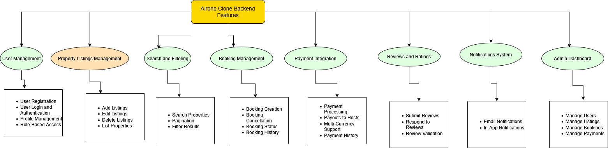

# Airbnb Clone Backend Features and Functionalities

This directory contains the documentation for the key features and functionalities of the Airbnb Clone backend, as outlined in the project requirements.

## Diagram
Below is a visual representation of the backend features, created using Draw.io:

## Core Functionalities
The diagram outlines the following modules and their features:
- **User Management**:
  - User Registration: Sign up as guest/host with JWT or OAuth.
  - User Login and Authentication: Email/password or OAuth login.
  - Profile Management: Update profile details.
  - Role-Based Access: Permissions for guests, hosts, admins.
- **Property Listings Management**:
  - Add/Edit/Delete Listings: Hosts manage property details.
  - List Properties: Display via search/filtering.
- **Search and Filtering**:
  - Search Properties: By location, price, guests, amenities.
  - Pagination and Filtering: Refine large datasets.
- **Booking Management**:
  - Booking Creation: Book with date validation.
  - Booking Cancellation: Per cancellation policy.
  - Booking Status and History: Track bookings.
- **Payment Integration**:
  - Payment Processing: Via Stripe/PayPal.
  - Payouts to Hosts: Automatic after booking.
  - Multi-Currency Support and Payment History.
- **Reviews and Ratings**:
  - Submit/Respond to Reviews: Linked to bookings.
  - Review Validation: Prevent abuse.
- **Notifications System**:
  - Email and In-App Notifications: For bookings, payments, cancellations.
- **Admin Dashboard**:
  - Manage Users, Listings, Bookings, and Payments.
